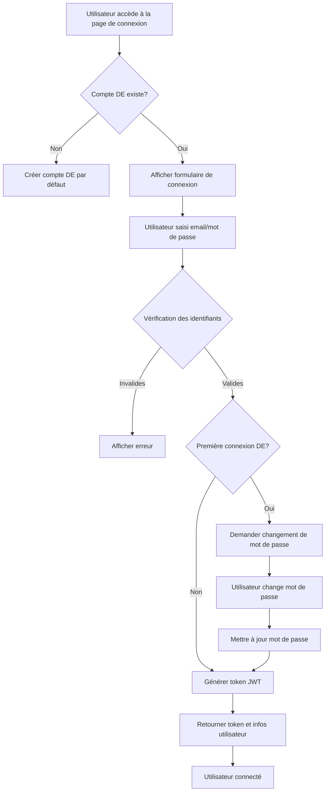

# Algorithme de Connexion pour le Système de Suivi de Projets

## Contexte
Le système doit permettre à tous les utilisateurs (DE, Formateurs, Étudiants) de se connecter avec leur identifiant et mot de passe. Pour le DE, un compte est créé dans le code avec des identifiants par défaut qui peuvent être modifiés lors de la première connexion.

## Structure des Modèles de la Base de Données

### Modèle `Utilisateur`
- `id_utilisateur`: Clé primaire (auto-incrément)
- `email`: Adresse email unique (nullable=False)
- `mot_de_passe`: Mot de passe haché (nullable=False)
- `nom`: Nom de l'utilisateur (nullable=False)
- `prenom`: Prénom de l'utilisateur (nullable=False)
- `role`: Rôle de l'utilisateur (DE, FORMATEUR, ETUDIANT)
- `actif`: Statut actif (Boolean, default=True)
- `date_creation`: Date de création (DateTime, default=datetime.utcnow)
- `token_activation`: Token d'activation (nullable=True)
- `date_expiration_token`: Date d'expiration du token (nullable=True)

### Modèle `Etudiant`
- `id_etudiant`: Clé primaire
- `id_utilisateur`: Clé étrangère vers Utilisateur (unique=True)
- `matricule`: Matricule unique
- `id_promotion`: Clé étrangère vers Promotion
- `date_inscription`: Date d'inscription
- `statut`: Statut de l'étudiant (ACTIF, SUSPENDU, EXCLU)

### Modèle `Formateur`
- `id_formateur`: Clé primaire
- `id_utilisateur`: Clé étrangère vers Utilisateur (unique=True)
- `numero_employe`: Numéro d'employé
- `specialite`: Spécialité du formateur

## Algorithme de Connexion

### 1. Initialisation du Compte DE (Default)
```pseudocode
FONCTION initialiser_compte_de()
    SI aucun compte DE n'existe dans la base de données ALORS
        // Créer un compte DE par défaut
        utilisateur_de = nouveau Utilisateur(
            email = "de@genielogiciel.com",
            mot_de_passe = hacher_mot_de_passe("admin123"),
            nom = "Administrateur",
            prenom = "DE",
            role = RoleEnum.DE,
            actif = True
        )
        Sauvegarder(utilisateur_de)
        // Créer l'entrée Formateur pour le DE
        formateur_de = nouveau Formateur(
            id_utilisateur = utilisateur_de.id_utilisateur,
            numero_employe = "DE001",
            specialite = "Administration"
        )
        Sauvegarder(formateur_de)
        RETURN utilisateur_de
    SINON
        RETURN null
    FIN SI
FIN FONCTION
```

### 2. Route de Connexion (Login)
```pseudocode
ROUTE POST /login
    PARAMÈTRES:
        - email: String (obligatoire)
        - mot_de_passe: String (obligatoire)
    
    ÉTAPES:
    1. Valider les paramètres d'entrée
    2. Rechercher l'utilisateur par email dans la base de données
    3. SI utilisateur non trouvé OU utilisateur.actif = False ALORS
        RETOURNER Erreur "Identifiants invalides ou compte désactivé"
    4. Vérifier si le mot de passe fourni correspond au mot de passe haché
    5. SI mot de passe incorrect ALORS
        RETOURNER Erreur "Identifiants invalides"
    6. Vérifier si c'est la première connexion du DE (email = "de@genielogiciel.com")
    7. SI première connexion DE ALORS
        a. Générer un token de réinitialisation
        b. Sauvegarder le token et sa date d'expiration (24h)
        c. RETOURNER {
            "message": "Première connexion - veuillez changer votre mot de passe",
            "token": token,
            "utilisateur": {
                "id": utilisateur.id_utilisateur,
                "nom": utilisateur.nom,
                "prenom": utilisateur.prenom,
                "role": utilisateur.role,
                "email": utilisateur.email
            }
        }
    8. SINON
        a. Générer un token JWT pour la session
        b. RETOURNER {
            "token": token_jwt,
            "utilisateur": {
                "id": utilisateur.id_utilisateur,
                "nom": utilisateur.nom,
                "prenom": utilisateur.prenom,
                "role": utilisateur.role,
                "email": utilisateur.email
            }
        }
    FIN SI
FIN ROUTE
```

### 3. Route de Changement de Mot de Passe (DE - Première Connexion)
```pseudocode
ROUTE POST /changer-mot-de-passe-premiere-connexion
    PARAMÈTRES:
        - token: String (obligatoire)
        - nouveau_mot_de_passe: String (obligatoire)
        - confirmation_mot_de_passe: String (obligatoire)
    
    ÉTAPES:
    1. Valider le token (vérifier existence et expiration)
    2. SI token invalide OU expiré ALORS
        RETOURNER Erreur "Token invalide ou expiré"
    3. Vérifier que les deux mots de passe sont identiques
    4. SI mots de passe différents ALORS
        RETOURNER Erreur "Les mots de passe ne correspondent pas"
    5. Rechercher l'utilisateur associé au token
    6. SI utilisateur non trouvé ALORS
        RETOURNER Erreur "Utilisateur non trouvé"
    7. Hacher le nouveau mot de passe
    8. Mettre à jour le mot de passe de l'utilisateur
    9. Supprimer le token d'activation
    10. Générer un token JWT pour la session
    11. RETOURNER {
            "message": "Mot de passe changé avec succès",
            "token": token_jwt,
            "utilisateur": {
                "id": utilisateur.id_utilisateur,
                "nom": utilisateur.nom,
                "prenom": utilisateur.prenom,
                "role": utilisateur.role,
                "email": utilisateur.email
            }
        }
FIN ROUTE
```

### 4. Route de Réinitialisation de Mot de Passe (Oubli)
```pseudocode
ROUTE POST /oubli-mot-de-passe
    PARAMÈTRES:
        - email: String (obligatoire)
    
    ÉTAPES:
    1. Rechercher l'utilisateur par email
    2. SI utilisateur non trouvé ALORS
        RETOURNER Succès "Si un compte existe, un email a été envoyé"
    3. Générer un token de réinitialisation unique
    4. Sauvegarder le token avec date d'expiration (1h)
    5. Envoyer email avec lien de réinitialisation
    6. RETOURNER Succès "Email de réinitialisation envoyé"
FIN ROUTE

ROUTE POST /reinitialiser-mot-de-passe
    PARAMÈTRES:
        - token: String (obligatoire)
        - nouveau_mot_de_passe: String (obligatoire)
        - confirmation_mot_de_passe: String (obligatoire)
    
    ÉTAPES:
    1. Valider le token
    2. Vérifier que les mots de passe correspondent
    3. Mettre à jour le mot de passe
    4. Supprimer le token
    5. RETOURNER Succès "Mot de passe réinitialisé"
FIN ROUTE
```

## Diagramme de Flux



## Sécurité

1. **Hachage des mots de passe**: Utiliser bcrypt ou PBKDF2 pour hacher les mots de passe
2. **Tokens JWT**: Utiliser des tokens signés avec une clé secrète pour l'authentification
3. **Tokens temporaires**: Les tokens de réinitialisation expirent après 1 heure
4. **Validation des entrées**: Toujours valider et nettoyer les entrées utilisateur
5. **Protection contre les attaques**: Limiter le nombre de tentatives de connexion

## Implémentation Recommandée

1. Créer un fichier `auth.py` dans le dossier `back` pour gérer l'authentification
2. Importer et utiliser les modèles existants
3. Ajouter les routes dans `main.py`
4. Configurer les dépendances FastAPI pour la validation des tokens JWT
5. Créer un middleware pour vérifier l'authentification sur les routes protégées
