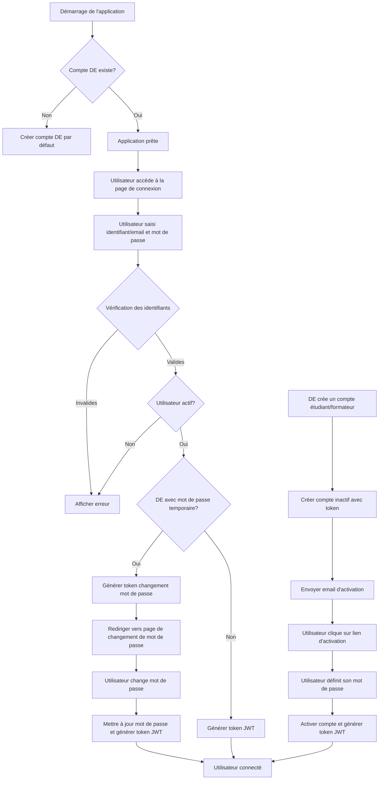

# Algorithme de Connexion - Version 2

## Structure des Modèles (Mise à jour)

### Modèle `Utilisateur`
- `identifiant`: Clé primaire (String, alphanumérique)
- `email`: Adresse email unique
- `mot_de_passe`: Mot de passe haché
- `nom`: Nom de l'utilisateur
- `prenom`: Prénom de l'utilisateur
- `role`: Rôle (DE, FORMATEUR, ETUDIANT)
- `actif`: Statut actif (Boolean, default=True)
- `date_creation`: Date de création
- `token_activation`: Token d'activation (nullable)
- `date_expiration_token`: Date d'expiration du token (nullable)

**Important**: Le DE n'a PAS de relation vers Formateur ou Etudiant

### Modèle `Etudiant`
- `id_etudiant`: Clé primaire (String)
- `identifiant`: Clé étrangère vers `utilisateur.identifiant`
- `matricule`: Matricule unique
- `id_promotion`: Clé étrangère vers Promotion
- `date_inscription`: Date d'inscription
- `statut`: Statut de l'étudiant

### Modèle `Formateur`
- `id_formateur`: Clé primaire (String)
- `identifiant`: Clé étrangère vers `utilisateur.identifiant`
- `numero_employe`: Numéro d'employé
- `specialite`: Spécialité du formateur

## Algorithme 1: Initialisation Automatique du Compte DE

```pseudocode
FONCTION initialiser_compte_de()
    // Vérifier si un compte DE existe déjà
    de = SELECT * FROM utilisateur WHERE role = "DE" LIMIT 1
    
    SI de EST VIDE ALORS
        // Créer un identifiant unique pour le DE
        identifiant_de = "de_principal"
        
        // Créer le compte DE
        nouveau_de = {
            identifiant: identifiant_de,
            email: "de@genielogiciel.com",
            mot_de_passe: hacher_mot_de_passe("admin123"),
            nom: "Directeur",
            prenom: "Établissement",
            role: "DE",
            actif: True,
            date_creation: datetime.utcnow(),
            token_activation: NULL,
            date_expiration_token: NULL
        }
        
        INSERT INTO utilisateur VALUES (nouveau_de)
        
        // NOTA: PAS de création de Formateur pour le DE
        // Le DE n'a pas de relation vers Formateur
        
        RETURN nouveau_de
    SINON
        RETURN de
    FIN SI
FIN FONCTION
```

## Algorithme 2: Route de Connexion (/login)

```pseudocode
ROUTE POST /login
    PARAMÈTRES:
        - identifiant_email: String (peut être identifiant ou email)
        - mot_de_passe: String
    
    ÉTAPES:
    
    1. // Rechercher l'utilisateur
        utilisateur = SELECT * FROM utilisateur 
                       WHERE (identifiant = identifiant_email OR email = identifiant_email)
                       LIMIT 1
    
    2. SI utilisateur EST VIDE ALORS
        RETOURNER Erreur {
            code: "AUTH_01",
            message: "Identifiants invalides"
        }
    
    3. SI utilisateur.actif = False ALORS
        RETOURNER Erreur {
            code: "AUTH_02",
            message: "Compte désactivé"
        }
    
    4. // Vérifier le mot de passe
        mot_de_passe_correct = verifier_mot_de_passe(mot_de_passe, utilisateur.mot_de_passe)
    
    5. SI mot_de_passe_correct = False ALORS
        RETOURNER Erreur {
            code: "AUTH_03",
            message: "Identifiants invalides"
        }
    
    6. // Vérifier si c'est le DE avec mot de passe temporaire
        est_de = (utilisateur.role == "DE")
        mot_de_passe_temporaire = (utilisateur.mot_de_passe == hacher_mot_de_passe("admin123"))
    
    7. SI est_de ET mot_de_passe_temporaire ALORS
        // Générer un token de changement de mot de passe (valide 24h)
        token_changement = generer_token_unique(32)
        date_expiration = datetime.utcnow() + timedelta(hours=24)
    
        // Sauvegarder le token
        UPDATE utilisateur SET 
            token_activation = token_changement,
            date_expiration_token = date_expiration
        WHERE identifiant = utilisateur.identifiant
    
        // Retourner réponse spéciale pour redirection
        RETOURNER {
            statut: "CHANGEMENT_MOT_DE_PASSE_REQUIS",
            token: token_changement,
            utilisateur: {
                identifiant: utilisateur.identifiant,
                nom: utilisateur.nom,
                prenom: utilisateur.prenom,
                role: utilisateur.role,
                email: utilisateur.email
            }
        }
    
    8. // Connexion normale
        token_jwt = generer_token_jwt(utilisateur)
    
        RETOURNER {
            statut: "SUCCESS",
            token: token_jwt,
            utilisateur: {
                identifiant: utilisateur.identifiant,
                nom: utilisateur.nom,
                prenom: utilisateur.prenom,
                role: utilisateur.role,
                email: utilisateur.email
            }
        }
FIN ROUTE
```

## Algorithme 3: Changement de Mot de Passe (DE - Première Connexion)

```pseudocode
ROUTE POST /changer-mot-de-passe
    PARAMÈTRES:
        - token: String
        - nouveau_mot_de_passe: String
        - confirmation_mot_de_passe: String
    
    ÉTAPES:
    
    1. // Valider le token
        utilisateur = SELECT * FROM utilisateur 
                       WHERE token_activation = token 
                       AND date_expiration_token > datetime.utcnow()
                       LIMIT 1
    
    2. SI utilisateur EST VIDE ALORS
        RETOURNER Erreur {
            code: "TOKEN_01",
            message: "Token invalide ou expiré"
        }
    
    3. // Vérifier que les mots de passe correspondent
        SI nouveau_mot_de_passe != confirmation_mot_de_passe ALORS
        RETOURNER Erreur {
            code: "PASSWORD_01",
            message: "Les mots de passe ne correspondent pas"
        }
    
    4. // Hacher le nouveau mot de passe
        mot_de_passe_hache = hacher_mot_de_passe(nouveau_mot_de_passe)
    
    5. // Mettre à jour le mot de passe et supprimer le token
        UPDATE utilisateur SET 
            mot_de_passe = mot_de_passe_hache,
            token_activation = NULL,
            date_expiration_token = NULL
        WHERE identifiant = utilisateur.identifiant
    
    6. // Générer token JWT pour la session
        token_jwt = generer_token_jwt(utilisateur)
    
        RETOURNER {
            statut: "SUCCESS",
            message: "Mot de passe changé avec succès",
            token: token_jwt,
            utilisateur: {
                identifiant: utilisateur.identifiant,
                nom: utilisateur.nom,
                prenom: utilisateur.prenom,
                role: utilisateur.role,
                email: utilisateur.email
            }
        }
FIN ROUTE
```

## Algorithme 4: Création de Compte par le DE (Étudiant/Formateur)

```pseudocode
FONCTION creer_compte_par_de(role, donnees)
    // Générer un identifiant unique
    identifiant = generer_identifiant_unique(role)
    
    // Créer le compte utilisateur (inactif)
    utilisateur = {
        identifiant: identifiant,
        email: donnees.email,
        mot_de_passe: "",  // Pas de mot de passe initial
        nom: donnees.nom,
        prenom: donnees.prenom,
        role: role,
        actif: False,  // Compte inactif par défaut
        date_creation: datetime.utcnow(),
        token_activation: generer_token_unique(32),
        date_expiration_token: datetime.utcnow() + timedelta(hours=72)  // Valide 72h
    }
    
    INSERT INTO utilisateur VALUES (utilisateur)
    
    // Créer l'entrée spécifique (Étudiant ou Formateur)
    SI role == "ETUDIANT" ALORS
        etudiant = {
            id_etudiant: generer_id_unique("ETD"),
            identifiant: identifiant,
            matricule: donnees.matricule,
            id_promotion: donnees.id_promotion,
            date_inscription: donnees.date_inscription,
            statut: "ACTIF"
        }
        INSERT INTO etudiant VALUES (etudiant)
    
    SINON SI role == "FORMATEUR" ALORS
        formateur = {
            id_formateur: generer_id_unique("FRM"),
            identifiant: identifiant,
            numero_employe: donnees.numero_employe,
            specialite: donnees.specialite
        }
        INSERT INTO formateur VALUES (formateur)
    FIN SI
    
    // Envoyer email d'activation avec le token
    lien_activation = "http://application/activation?token=" + utilisateur.token_activation
    envoyer_email(donnees.email, "Activation de votre compte", 
                  "Veuillez activer votre compte en cliquant sur ce lien: " + lien_activation)
    
    RETURN {
        statut: "SUCCESS",
        message: "Compte créé. Un email d'activation a été envoyé.",
        utilisateur: {
            identifiant: utilisateur.identifiant,
            email: utilisateur.email,
            nom: utilisateur.nom,
            prenom: utilisateur.prenom,
            role: utilisateur.role
        }
    }
FIN FONCTION
```

## Algorithme 5: Activation de Compte (Étudiant/Formateur)

```pseudocode
ROUTE POST /activer-compte
    PARAMÈTRES:
        - token: String
        - mot_de_passe: String
        - confirmation_mot_de_passe: String
    
    ÉTAPES:
    
    1. // Valider le token
        utilisateur = SELECT * FROM utilisateur 
                       WHERE token_activation = token 
                       AND date_expiration_token > datetime.utcnow()
                       LIMIT 1
    
    2. SI utilisateur EST VIDE ALORS
        RETOURNER Erreur {
            code: "TOKEN_01",
            message: "Token invalide ou expiré"
        }
    
    3. // Vérifier que les mots de passe correspondent
        SI mot_de_passe != confirmation_mot_de_passe ALORS
        RETOURNER Erreur {
            code: "PASSWORD_01",
            message: "Les mots de passe ne correspondent pas"
        }
    
    4. // Hacher le mot de passe
        mot_de_passe_hache = hacher_mot_de_passe(mot_de_passe)
    
    5. // Activer le compte
        UPDATE utilisateur SET 
            mot_de_passe = mot_de_passe_hache,
            actif = True,
            token_activation = NULL,
            date_expiration_token = NULL
        WHERE identifiant = utilisateur.identifiant
    
    6. // Générer token JWT pour la première connexion
        token_jwt = generer_token_jwt(utilisateur)
    
        RETOURNER {
            statut: "SUCCESS",
            message: "Compte activé avec succès. Vous pouvez maintenant vous connecter.",
            token: token_jwt,
            utilisateur: {
                identifiant: utilisateur.identifiant,
                nom: utilisateur.nom,
                prenom: utilisateur.prenom,
                role: utilisateur.role,
                email: utilisateur.email
            }
        }
FIN ROUTE
```

## Diagramme de Flux Global



## Validations et Sécurité

### Validations:
1. **Identifiant/Email**: Doit être une chaîne non vide
2. **Mot de passe**: Doit avoir au moins 8 caractères
3. **Token**: Doit être valide et non expiré
4. **Email**: Doit être au format valide
5. **Rôle**: Doit être l'un des rôles définis (DE, FORMATEUR, ETUDIANT)

### Sécurité:
1. **Hachage**: Tous les mots de passe sont hachés avec bcrypt ou PBKDF2
2. **Tokens**: Tokens uniques générés pour chaque opération sensible
3. **Expiration**: Tokens d'activation expirent après 72h, tokens de changement après 24h
4. **JWT**: Tokens signés pour l'authentification des sessions
5. **Protection contre les attaques**: Limiter les tentatives de connexion (3 essais max)

## Structures de Données Utilisées

### Utilisateur
```
{
    identifiant: String (primary key),
    email: String (unique),
    mot_de_passe: String (haché),
    nom: String,
    prenom: String,
    role: Enum (DE, FORMATEUR, ETUDIANT),
    actif: Boolean,
    date_creation: DateTime,
    token_activation: String (nullable),
    date_expiration_token: DateTime (nullable)
}
```

### Étudiant
```
{
    id_etudiant: String (primary key),
    identifiant: String (foreign key -> utilisateur.identifiant),
    matricule: String (unique),
    id_promotion: String (foreign key -> promotion.id_promotion),
    date_inscription: Date,
    statut: Enum (ACTIF, SUSPENDU, EXCLU)
}
```

### Formateur
```
{
    id_formateur: String (primary key),
    identifiant: String (foreign key -> utilisateur.identifiant),
    numero_employe: String,
    specialite: String
}
```

## Cas Particuliers

1. **DE sans Formateur**: Le DE est un utilisateur de rôle "DE" sans entrée dans la table Formateur
2. **Compte inactif**: Les comptes créés par le DE sont inactifs jusqu'à activation
3. **Mot de passe temporaire**: Le DE a un mot de passe par défaut qui doit être changé à la première connexion
4. **Identifiant vs Email**: La connexion peut se faire avec l'identifiant ou l'email
